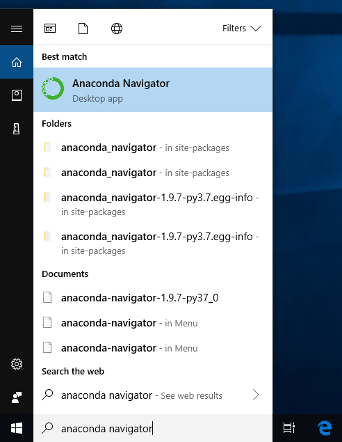
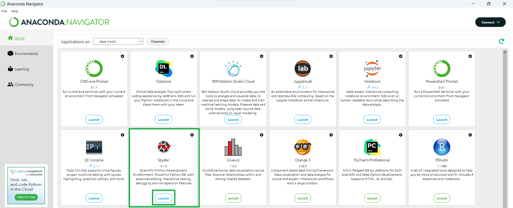

## Installing Spyder using Anaconda and conda

For new users, we **highly recommend** [installing Anaconda](https://www.anaconda.com/products/distribution). Anaconda conveniently installs Python, the Jupyter Notebook, Spyder, and other commonly used packages for scientific computing and data science.

Use the following installation steps:

* Download [Anaconda](https://www.anaconda.com/products/distribution). We recommend downloading Anaconda’s latest Python 3 version (currently Python 3.9).

* Install the version of Anaconda which you downloaded, following the instructions on the download page.

* Congratulations, you have installed Jupyter Notebook. To run the notebook:

## Getting started with Anaconda

Anaconda Distribution contains conda and Anaconda Navigator, as well as Python and hundreds of scientific packages. When you installed Anaconda, you installed all these too.

Conda works on your command line interface such as Anaconda Prompt on Windows and terminal on macOS and Linux.

Navigator is a desktop graphical user interface that allows you to launch applications and easily manage conda packages, environments, and channels without using command-line commands.

## Your first Python program: Hello, Anaconda!
Use Anaconda Navigator to launch an application. Then, create and run a simple Python program with **Jupyter Notebook**.

### Open Navigator
Choose the instructions for your operating system: 

#### Windows:
From the Start menu, click the Anaconda Navigator desktop app.

#### macOS:
Open Launchpad, then click the Anaconda Navigator icon.

#### Linux:
Open a terminal window and type `anaconda-navigator`.

## Launch Spyder

