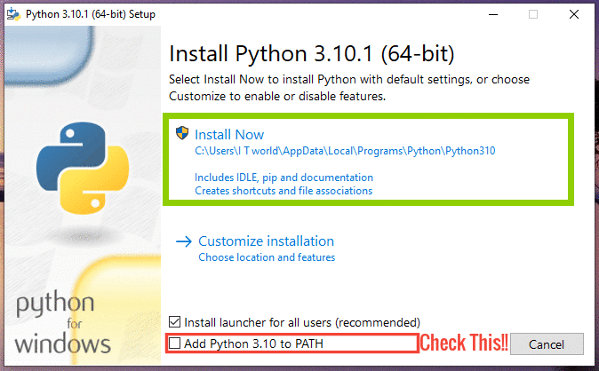

### Download and Install python 3.10.1
https://www.python.org/downloads/

  
*Check the 'add to PATH' option* - Adding Python to PATH makes it possible for you to run (use) Python from your command prompt (also known as command-line or cmd). This lets you access the Python shell from your command prompt. In simpler terms, you can run your code from the Python shell by just typing “python” in the command prompt

In the command prompt type 'python --version' and if installation done correct you would see Python 3.10.1