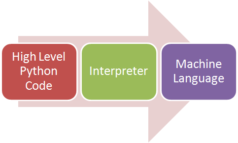

# Introduction To Python Programming

Python is an interpreted, object-oriented, high-level programming language with dynamic semantics. Its high-level
built-in data structures, combined with dynamic typing and dynamic binding, make it very attractive for Rapid
Application Development, as well as for use as a scripting or glue language to connect existing components together.
Python’s simple, easy-to-learn syntax emphasizes readability and therefore reduces the cost of program maintenance.
Python supports modules and packages, which encourages program modularity and code reuse.

## Why Python?

- Python is the most popular language due to the fact that it’s easier to code and understand it.
- Python is an object-oriented programming language and can be used to write functional code too.
- It is a suitable language that bridges the gaps between business and developers.
- Subsequently, it takes less time to bring a Python program to market compared to other languages such as C#/Java.
- Additionally, there are a large number of python machine learning and analytical packages.
- A large number of communities and books are available to support Python developers.
- Nearly all types of applications, ranging from forecasting analytical to UI, can be implemented in Python.
- There is no need to declare variable types. Thus it is quicker to implement a Python application.

## Why Not Python?

- Python is slower than C++, C#, Java. This is due to the lack of Just In Time optimisers in Python.
- Python syntactical white-space constraint makes it slightly difficult to implement for new coders.
- Python does not offer advanced statistical features as R does.
- Python is not suitable for low-level systems and hardware interaction.

## How Does Python Work?

This image illustrates how python runs on our machines:

The key here is the Interpreter that is responsible for translating high-level Python language to low-level machine language.

The way Python works is as follows:

1. A Python virtual machine is created where the packages (libraries) are installed. Think of a virtual machine as a container.
2. The python code is then written in .py files
3. CPython compiles the Python code to bytecode. This bytecode is for the Python virtual machine.

### Source
https://www.zigya.com/blog/what-is-python/